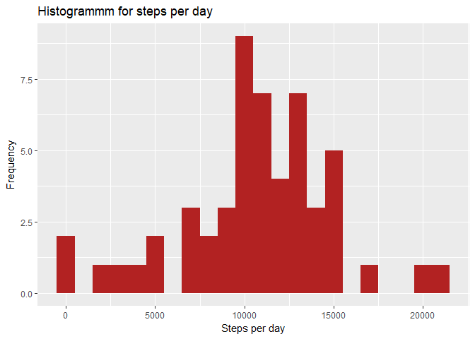
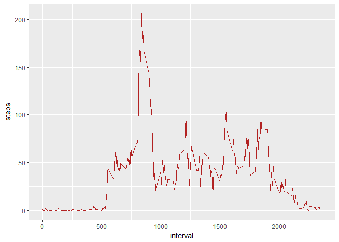
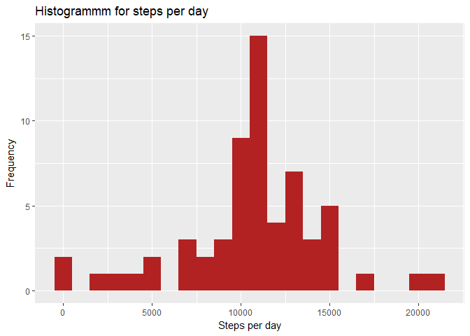
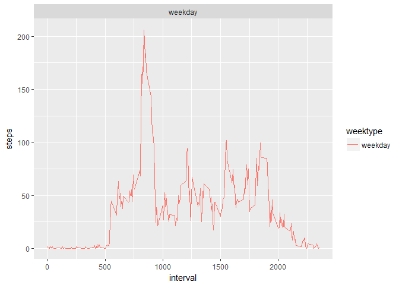

# Reproducible Research: Peer Assessment 1

# Introduction

It is now possible to collect a large amount of data about personal movement using activity monitoring devices such as a Fitbit, Nike Fuelband, or Jawbone Up. These type of devices are part of the "quantified self" movement - a group of enthusiasts who take measurements about themselves regularly to improve their health, to find patterns in their behavior, or because they are tech geeks. But these data remain under-utilized both because the raw data are hard to obtain and there is a lack of statistical methods and software for processing and interpreting the data.

This assignment makes use of data from a personal activity monitoring device. This device collects data at 5 minute intervals through out the day. The data consists of two months of data from an anonymous individual collected during the months of October and November, 2012 and include the number of steps taken in 5 minute intervals each day.

## Data

The data for this assignment can be downloaded from the course web site:

- Dataset: Activity monitoring data [52K]

The variables included in this dataset are:

- steps: Number of steps taking in a 5-minute interval (missing values are coded as NA)
- date: The date on which the measurement was taken in YYYY-MM-DD format
- interval: Identifier for the 5-minute interval in which measurement was taken

The dataset is stored in a comma-separated-value (CSV) file and there are a total of 17,568 observations in this dataset.

## Task

This document presents the results from Project Assignment 1 in the course Reproducible Research, written in a single R markdown document that can be processed by knitr and transformed into an HTML file.

## imports

Load the needed libraries.


```r
library(knitr)
library(dplyr)
```

```
## 
## Attaching package: 'dplyr'
```

```
## The following objects are masked from 'package:stats':
## 
##     filter, lag
```

```
## The following objects are masked from 'package:base':
## 
##     intersect, setdiff, setequal, union
```

```r
library(lubridate)
```

```
## 
## Attaching package: 'lubridate'
```

```
## The following object is masked from 'package:base':
## 
##     date
```

```r
library(ggplot2)
```

## Loading and preprocessing the data

Setting the directory and load the data.


```r
setwd("C:/Users/Master/Documents/Coursera/Data_Science/5Reproducible_Reasearch/Assignments/Meine_Solution/RepData_PeerAssessment1")
data <- read.csv("activity.csv", header = TRUE, sep = ',', colClasses = c("numeric", "character", "integer"))
```

Now we tidy the data. First we change the date column into the right dateformat using lubridate.


```r
data$date <- ymd(data$date)
str(data)
```

```
## 'data.frame':	17568 obs. of  3 variables:
##  $ steps   : num  NA NA NA NA NA NA NA NA NA NA ...
##  $ date    : Date, format: "2012-10-01" "2012-10-01" ...
##  $ interval: int  0 5 10 15 20 25 30 35 40 45 ...
```
## What is mean total number of steps taken per day?


```r
steps <- data
steps <- filter(steps, !is.na(steps))
steps <- group_by(steps, date)
steps <- summarize(steps, steps = sum(steps))
print(steps)
```

```
## # A tibble: 53 × 2
##          date steps
##        <date> <dbl>
## 1  2012-10-02   126
## 2  2012-10-03 11352
## 3  2012-10-04 12116
## 4  2012-10-05 13294
## 5  2012-10-06 15420
## 6  2012-10-07 11015
## 7  2012-10-09 12811
## 8  2012-10-10  9900
## 9  2012-10-11 10304
## 10 2012-10-12 17382
## # ... with 43 more rows
```

Here is the plot for the histogramm. We use gplot.


```r
ggplot(steps, aes( x= steps)) + geom_histogram(fill = "firebrick", binwidth = 1000) + labs(title = "Histogrammm for steps per day", x = "Steps per day", y = "Frequency")
```

<!-- -->

For the last step of this part, here are the mean and median steps per day.


```r
meanSteps <- mean(steps$steps, na.rm = TRUE)
medianSteps <- median(steps$steps, na.rm = TRUE)
print(meanSteps)
```

```
## [1] 10766.19
```

```r
print(medianSteps)
```

```
## [1] 10765
```

## What is the average daily activity pattern?

In this part we are making a time series plot of the 5 minute interval and the avaerage number of steps taken, averged across all days. We calculate also the maximimum of the averages per day.


```r
interval <- data %>%
  filter(!is.na(steps)) %>%
  group_by(interval) %>%
  summarize(steps = mean(steps))
interval[which.max(interval$steps),]
```

```
## # A tibble: 1 × 2
##   interval    steps
##      <int>    <dbl>
## 1      835 206.1698
```

This is the plot for the time serie.


```r
ggplot(interval, aes(x=interval, y=steps)) +
  geom_line(color = "firebrick")
```

<!-- -->

## Imputing missing values

In this section we are going to answer the following questions.

1. Calculate and report the total number of missing values in the dataset (i.e. the total number of rows with NAs).
2. Devise a strategy for filling in all of the missing values in the dataset. The strategy does not need to be sophisticated. For example, you could use the mean/median for that day, or the mean for that 5-minute interval, etc.
3. Create a new dataset that is equal to the original dataset but with the missing data filled in.
4. Make a histogram of the total number of steps taken each day and calculate and report the mean and median total number of steps taken per day. Do these values differ from the estimates from the first part of the assignment? What is the impact of imputing missing data on the estimates of the total daily number of steps?


```r
total_NA <- sum(is.na(data$steps))
print(total_NA)
```

```
## [1] 2304
```

The total amount of rows with NAs is 2304.


```r
data_no_na <- data
nas <- is.na(data_no_na$steps)
interval_avg <- tapply(data_no_na$steps, data_no_na$interval, mean, na.rm = TRUE, simplify = TRUE)
data_no_na$steps[nas] <- interval_avg[as.character(data_no_na$interval[nas])]
print(sum(is.na(data_no_na$steps)))
```

```
## [1] 0
```

As we can see on the last print statement, there are no issing values anymore.


```r
steps_no_na <- data_no_na
steps_no_na <- filter(steps_no_na, !is.na(steps))
steps_no_na <- group_by(steps_no_na, date)
steps_no_na <- summarize(steps_no_na, steps = sum(steps))
print(steps_no_na)
```

```
## # A tibble: 61 × 2
##          date    steps
##        <date>    <dbl>
## 1  2012-10-01 10766.19
## 2  2012-10-02   126.00
## 3  2012-10-03 11352.00
## 4  2012-10-04 12116.00
## 5  2012-10-05 13294.00
## 6  2012-10-06 15420.00
## 7  2012-10-07 11015.00
## 8  2012-10-08 10766.19
## 9  2012-10-09 12811.00
## 10 2012-10-10  9900.00
## # ... with 51 more rows
```

```r
ggplot(steps_no_na, aes( x= steps)) + geom_histogram(fill = "firebrick", binwidth = 1000) + labs(title = "Histogrammm for steps per day", x = "Steps per day", y = "Frequency")
```

<!-- -->


```r
meanSteps_no_na <- mean(steps_no_na$steps, na.rm = TRUE)
medianSteps_no_na <- median(steps_no_na$steps, na.rm = TRUE)
print(meanSteps_no_na)
```

```
## [1] 10766.19
```

```r
print(medianSteps_no_na)
```

```
## [1] 10766.19
```

We can see that the impact of imputing the missing values with the mean umber of steps in 5 minute interval is that both the mmean and the median are now 10766.19.

## Are there differences in activity patterns between weekdays and weekends?


```r
data_no_na <- mutate(data_no_na, weektype = ifelse(weekdays(data_no_na$date) == "Saturday" | weekdays(data_no_na$date) == "Sunday", "weekend", "weekday"))
data_no_na$weektype <- as.factor(data_no_na$weektype)
head(data_no_na)
```

```
##       steps       date interval weektype
## 1 1.7169811 2012-10-01        0  weekday
## 2 0.3396226 2012-10-01        5  weekday
## 3 0.1320755 2012-10-01       10  weekday
## 4 0.1509434 2012-10-01       15  weekday
## 5 0.0754717 2012-10-01       20  weekday
## 6 2.0943396 2012-10-01       25  weekday
```


```r
interval_week <- data_no_na %>%
  group_by(interval, weektype) %>%
  summarise(steps = mean(steps))
plot <- ggplot(interval_week, aes(x=interval, y=steps, color = weektype)) +
  geom_line() +
  facet_wrap(~weektype, ncol = 1, nrow=2)
print(plot)
```

<!-- -->

On the two plots we can see, that there is more activity on early on weekdays and overall a higher activity on weekends than on weekdays.
